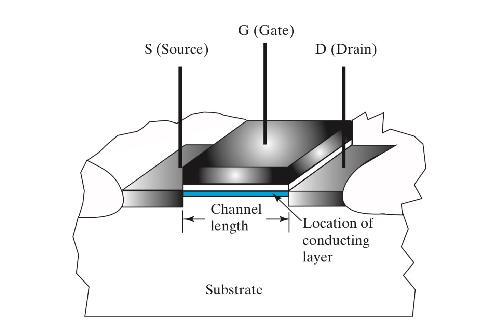
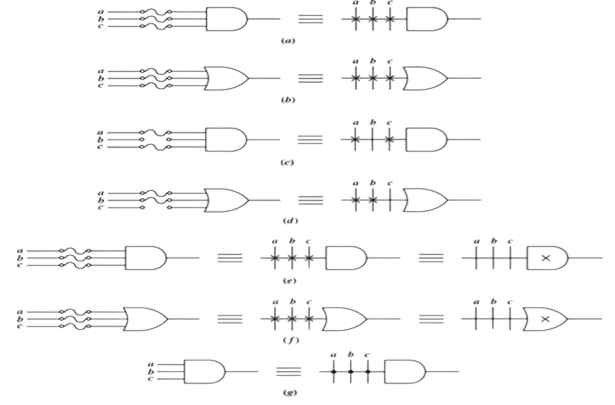
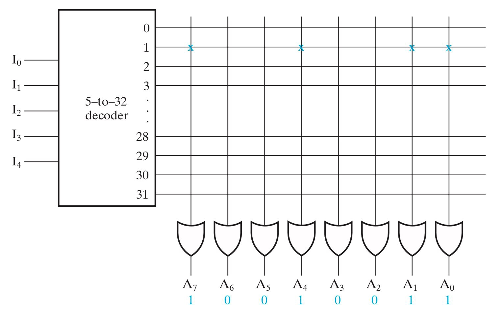
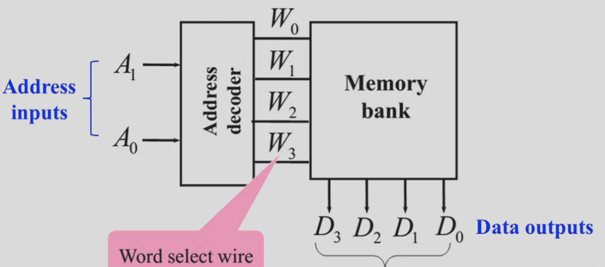
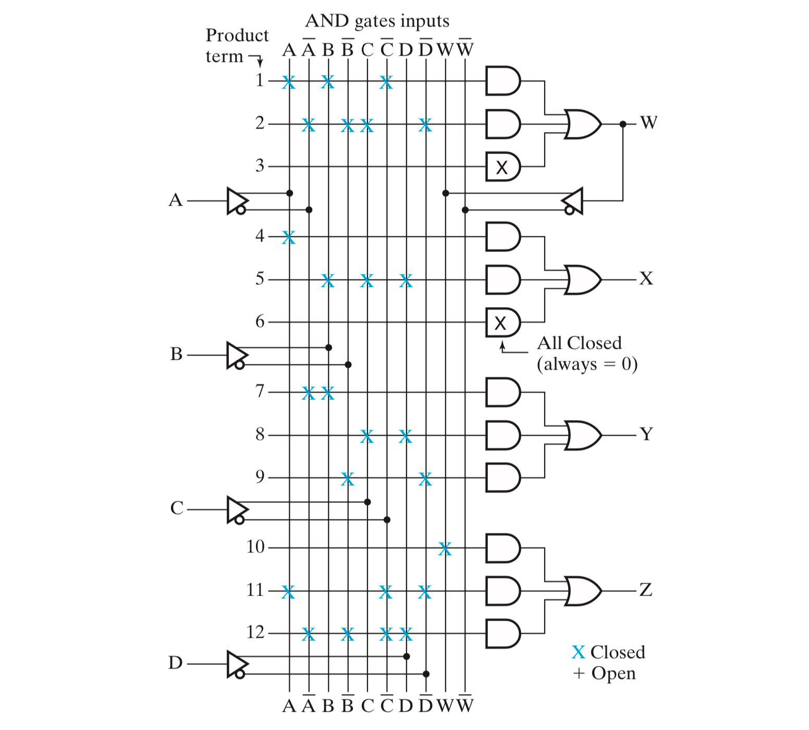
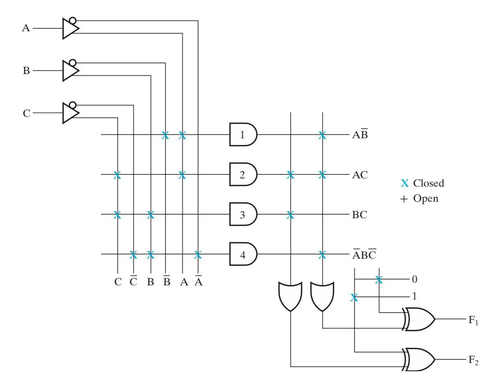
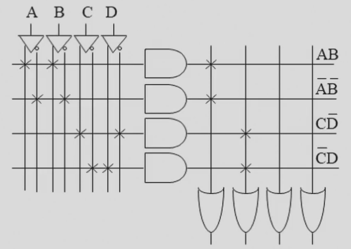
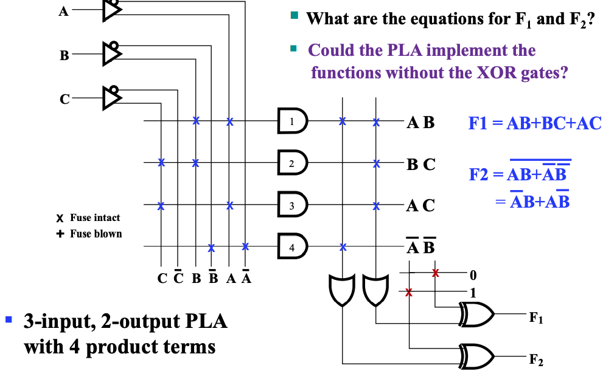
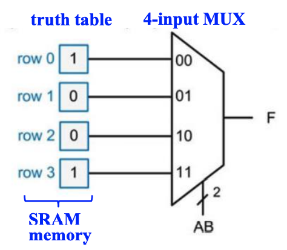
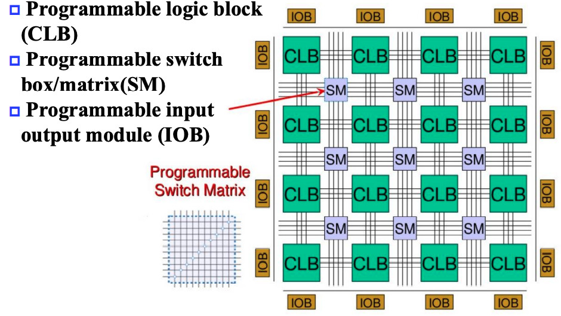

# 5.x Digital Hardware Implementation

!!! info "引入"

    本章内容主要关于数字逻辑的硬件实现，分别介绍 **设计空间(The Design Space)** 和 **可编程技术(Programmable Implementation Technologies)**：

    - 在数字逻辑的设计空间中，COMS 凭借其较高的抗噪性能和较低的能耗，成为目前应用最广泛的硬件技术之一；
    - 可编程技术使得硬件在出厂后，能够根据用户的需求进一步编辑硬件，从而实现特定的逻辑功能；
        - 更进一步地，可编程技术又可以分为永久(permanent)编程技术和可重(reprogrammable)编程技术；

---

## 设计空间

### 集成电路

集成电路(IC)这部分内容在 **[第三章#集成电路](3-x.md#集成电路)** 中已经介绍过了，此处不再赘述。

---

### CMOS

!!! summary "前置知识"

    金属氧化物半导体场效应管(Metal-Oxide-Semiconductor Field-Effect Transistor， or MOSFET)简称 **MOS**，是一种广泛应用于数字电路和模拟电路的硬件。MOS 的基本结构如下图所示，其具体工作原理此处不做展开，我们只需要知道，MOS 的作用相当于一个开关，通过控制门极(Gate)的电压，来控制 MOS 的开闭。

    

    ---

    互补式金属氧化物半导体(Complementary Metal–Oxide–Semiconductor)简称 **CMOS**，是集成电路中最重要的一种设计工艺。其主要有对称的两部分组成，这两部分分别使用了 n-channel MOS(**NMOS**)和 p-channel MOS(**PMOS**)。

    对于 NMOS，门极输入 X 为 `0` 时断开（称为“常开”），X 为 `1` 时导通；对于 PMOS，门极输入 X 为 `0` 时导通（称为“常闭”），X 为 `1` 时断开。

    

    ---

    更进一步地，我们可以利用 MOS 的开关特性，来实现一些简单的“与”和“或”的逻辑（注意这里的实现是有问题的，真正的实现应该用 CMOS）：

    

    > 左图实现了 $\overline{X} \cdot \overline{Y}$，右图实现了 $X+Y$。

---

下面给出一幅图来介绍 CMOS 的经典结构：

首先让我们来看图(a)，这是 CMOS 的通用结构（可以被称作 static CMOS）。其可以分为上下两部分，上半部分接电源，由 PMOS 设计出 $F$ 的逻辑；下半部分接地，由 NMOS 设计出 $\overline{F}$ 的逻辑。也就是说 CMOS 同时需要实现 $F$ 和 $\overline{F}$，这就是其名称 complementary 的由来。

CMOS 在结构上的最大特征就是，其 PMOS 的电路和 NMOS 的电路是对偶的，这使得我们只需要设计出两者中的一个，就可以利用对偶直接得到另一个。如果觉得不够显然，请复习一下第二章的 **[#对偶法则](2-x.md#对偶法则)** 和 **[#互补函数](2-x.md#互补函数)** 有关内容。

!!! summary "经验之谈"

    根据逻辑表达式设计 CMOS 的时候，建议从下半部分开始设计，即用 NMOS 表达出 $\overline{F}$，然后再对偶地设计出上半部分。上图给出了最经典的 NOR、NAND、NOT 的 CMOS 实现，自己试试吧！

    > 值得注意的是，PMOS 符号中的圆圈并不代表负逻辑。它只是为了区分 NMOS 和 PMOS，并没有任何逻辑意义！

??? question "为什么 PMOS 接电源而 NMOS 接地？"

    > 这个问题数字逻辑设计这门课并不深究，通常认为采用这种接法和 PMOS 与 NMOS 的电学特性有关。

---

我们注意到，对于任何输入，CMOS 的上下两部分总是一个导通，而另一个断开。这就意味着理论上 CMOS 并不存在电流通路（即从电源指向接地的电路），所以不论 CMOS 是否处在工作状态，其总是没有能耗的（然而实际上会存在少量能耗，这是因为输入信号变化不是绝对瞬时的，CMOS 会在信号变化的边沿短暂地形成电流通路）。

得益于 CMOS 巧妙的对偶设计，其具有**较强的抗噪能力**和**较低的能耗**。直至今天，CMOS 仍然在 LSI 和 VLSI 集成电路设计中被广泛使用。

---

## 可编程技术

直接更改硬件布线来修改电路功能被称为硬编程，而可编程技术让我们能够在不直接更改硬件布线的情况下，利用软件编程来间接更改硬件布线。硬编程的操作者是设计制造者(manufacturer)，而软编程的操作者是用户(user)。

!!! info "为什么我们需要可编程技术？"

    以一块芯片为例，其成本主要包括固定成本（用于设计制作掩模，即 mask）和制作成本（加工一块芯片的原料和工艺成本）。固定成本是极高的，如果一块芯片普适性不够强，用户群不够广，那么生产数额就不够大，从而均摊到每块芯片的固定成本就会很高。所以对于有特定逻辑功能的芯片而言，其定位的受众群体必然是庞大的，往往达到万级甚至亿级，比如手机芯片。

    但是，很多时候我们需要某种特定功能的芯片，但这种芯片只用在少部分地方。这时候如果专门去设计一款芯片，那么其均摊成本就会非常高。可编程技术可以解决这个问题，我们只需要设计一款通用的可编程的芯片，并在出厂后根据用户的特定需求进行相应的编辑修改即可。

---

可编程技术在硬件层面主要有三种实现手段：

- 控制连接来实现(Control Connections)：
    - Mask programing
    - Fuse（类似于保险丝，通过高电压来切断部分电路来实现）
    - Anti-fuse（Fuse 的反操作，通过高电压来联通部分电路来实现）
    - Single-bit storage element
- 使用查找表(Lookup Tables)：
    - Storage elements for the function
        - 比如使用一个 `MUX`，并将输入端接内存，通过修改内存的值来修改 `MUX` 的行为，进而实现函数重编程
- 控制晶体管开关实现(Control Transistor Switching)

---

进一步地，可编程技术可以分为 **永久编程技术** 和 **可重编程技术** ：

- 永久(permanent)编程技术：出厂后经过一次编程，便永久成型；
    - Mask programming
    - Fuse
    - Anti-fuse
- 可重(reprogrammable)编程技术：允许重复进行编程；
    - Volatile：断电后编程信息会丢失；
        - Single-bit storage element
    - Non-Volatile：编程信息仅在擦除操作后才会消失，不受断电影响；
        - Flash (as in Flash Memory)

---

### 常见的可编程技术

课程中介绍的可编程技术主要有如下四种：

- 只读内存 Read Only Memory (ROM) 
- 可编程阵列逻辑 Programmable Array Logic (PAL^Ⓡ^)
- 可编程逻辑阵列 Programmable Logic Array (PLA)
- Complex Programmable Logic Device (CPLD) or Field-Programmable Gate Array(FPGA)

前三者都只能编程一次（属于永久编程技术），如下是它们的可编程内容：

???+ eg "FPGA"

    [现场可编程逻辑门阵列(Field-Programmable Gate Array, or FPGA)](https://en.wikipedia.org/wiki/Field-programmable_gate_array)

---

!!! info "引入"
    
    由于之后出现的电路图会非常庞大，所以需要引入一些逻辑符号。

    !!! eg "Buffer"
        
        > 简化表示一个变量的自身和其非；

    !!! eg "Wire connecting"
        
        在可编程逻辑电路中，线的连接不再只有单纯的连通和不连通的关系：

        对于两条相交导线：
        
        - 如果没有特殊符号，则表示这个交叉点 is not connected ；

        

        - 如果有一个 ❌，则表示这个交叉点 is connected and programmable；

        

        - 如果只有一个加粗的点，则表示这个交叉点 is connected but not programmable；

        

    特别的，如果一个元器件的所有输入都是 programmable，我们也可以选择把这个 ❌ 画到逻辑门上（如下图 e 和 f）。

    

---

- [ ] 下文对于几种常见的可编程技术的介绍比较有限，数逻课堂上也只是一带而过。如果有机会的话，其实需要更进一步斟酌这些内容。

---

#### ROM

$2^N\times M$ ROM 由 $N$ 个输入，$M$ 个输出，以及 $2^N$ 个译码后的最小项组成。其中，固定的 AND 用于设计译码器，实现所有的 $2^N$ 个最小项；可编程的 OR 用于把这些最小项“或”起来并实现特定逻辑。

严格来说，ROM 是不可编程的，PROM 才是可编程的。**PROM(Programmable ROM)** 通过 fuse 或 anti-fuse 等手段实现可编程，所以在出厂后仅可进行一次编程修改，属于永久编程技术。

ROM 可以被视作一个 memory，输入提供了一组地址(address)，而输出则是这组地址对应的 memory 中存储的信息。从这个角度来看，ROM 的确具有「只读」的特征。

???+ eg "eg"

    ROM 的一种常见写法如下：

    

<!-- 这部分内容已经被重构成上文，为了后续维护方便，故先隐藏在此，作为原作者的副本。 # MinJoker

ROM 的基本结构如下：

而 ROM 的大小如下计算（以上图为例）：   # MinJoker: 大小计算这部分内容马德老师没有提及，加上本身也比较容易理解，故先删去。

$$
\begin{aligned}
    ROM\;\;size\;\;&=\;\;address\;\;width\;\;\times\;\;word\;\;width&\\
                   &=\;\;2^2\;\;\times\;\;4\;\;=\;\;16\;\;bit&
\end{aligned}
$$

???+ eg "eg"
    更清晰的表示其内部逻辑的，可以将 ROM 写成这样：

    

-->

---

#### PAL

PAL 与 ROM 恰恰相反，其具有固定的 OR 和一批可编程的 AND。

- PAL 不需要像 ROM 那样列出所有最小项，这就意味着 PAL 是可优化的，因此 PAL 在很多时候比 ROM 更高效更节约；
- 但也正是因为它不像 ROM 那样能够枚举最小项来实现所有逻辑，PAL 不一定能表达所有逻辑；
    - 一种改进方法是，通过将一个既有的 PAL 输出当作输入，输入到另外一个函数中，来弥补项不足的问题，例如下图的 $W$；

???+ eg "eg"

    PAL 的一种常见写法如下：

    

<!-- 这部分内容已经被重构成上文，为了后续维护方便，故先隐藏在此，作为原作者的副本。 # MinJoker

可重编程输入组合来得到固定输出。

其具有一个缺陷是，因为表达函数的方法不是通过 SOM 或者 POM 的形式，所以不一定能够完备表达函数。

在此基础上的一个改进是，通过将一个既有的 PAL 输出当作输入，输入到另外一个函数中，来弥补项不足的问题。

???+ eg "eg"
    

-->

---

#### PLA

PLA 在设计上和 ROM 类似，区别在于 PLA 并不使用译码器获得所有最小项，而是用可编程的 AND 阵列来代替译码器。

- PLA 具有可编程的 AND 和 OR，因此比起 PAL 和 ROM 更具灵活性；
- 但是灵活性带来的弊端是，PLA 的优化会变得更加复杂，这对于优化软件有着更高的要求；
- 此外，PLA 和 PAL 具有一样的问题，就是无法表达所有逻辑函数；
    - 一种改进方法是，在输出的时候再做一次异或（不用非门体现了可编程的思想），以产生新的项，来弥补项不足的问题；

???+ eg "eg"

    PLA 的一种常见写法如下：

    

<!-- 这部分内容已经被重构成上文，为了后续维护方便，故先隐藏在此，作为原作者的副本。 # MinJoker

与 PAL 的区别在于，在输出的时候也能对输出组合进行重编程。

其同 PAL 一样具有一个缺陷是，因为表达函数的方法不是通过 SOM 或者 POM 的形式，所以不一定能够完备表达函数。

在基础上一个改进是在输出的时候再做一次异或（不用非门体现了可重编程的思想），以产生新的项，来弥补项不足的问题。

可以发现，出现了新的项。

-->

---

### Lookup Tables

!!! warning "考试须知"

    Lookup Tables 这部分内容不作考试要求。

???+ eg "LUT"

    [查找表(Lookup Tables, or LUT)](https://en.wikipedia.org/wiki/Lookup_table)

---

通过让数据源接内存，并通过修改真值表内的值，即修改内存里的值，来实现数据源的变化，来改变 `MUX` 的行为。

但是实际应用中，函数输入的数量会变化，因此我们需要通过灵活组合的方法（比如通过四选二选一的方式，用三个二选一的 `MUX` 来实现四选一）来实现多输入。

常见的 `LUT` 大小以 16bits 或 64bits 的 4 输入或 6 输入为主。

由于 `LUT` 存的本质上是真值表，所以它可以实现任意输入符合要求的逻辑函数。

所以，问题就变化为如何用较小的 `LUT` 来组合实现复杂的逻辑函数。

`LUT` 的基本结构如下：

`FPGA` 的基本结构如下：

其主要分为三个组成部分：

- CLB(Configurable Logic Block)
    - 大量存储 `LUT`
- SM(Switch Matrix)
    - 可编程的交换矩阵
- IOB(Input & Output Block)
    - 可编程的输入输出单元

---

#### CLB

CLB 是 `FPGA` 中的基础逻辑单元。

---

#### SM

通过相当复杂的算法， `SM` 会根据目标逻辑，选择链接不同的 `CLB` 以实现复杂逻辑。

它具有这些基本属性：

1. Flexibility: 评估一条线可以连接到多少线；
2. Topology: 哪些线可以被连接到；
3. Routability: 有多少回路可以被路由；

---

#### IOB

`IOB` 用来对外部设备进行连接，用来控制输入和输出。

---

??? eg "eg for `FPGA`"
    通过 `FPGA` 实现 $f=x_1x_2+\overline{x_2x_3}$：

    分解问题：$f_1 = x_1x_2,\;\;f_2=\overline{x_2x_3},\;\;f=f_1+f_2$。

    

在软件层面编程完后，会生成位流文件(`bitfile`)，下载到板时会更新 `FPGA` 中的内容。

---

!!! summary "组合函数的实现方法"
    到目前为止，不管是可编程还是不可编程，都已经介绍了很多方法，这里进行一次小结：

    1. `Decoder`s & `OR` gates
         - 将译码出来的需要的目标组合都 `OR` 在一起；
    2. `MUX`s
         - 通过多路选择器实现任意逻辑函数； 
    3. `ROM`s
    4. `PAL`s
    5. `PLA`s
    6. `LUT`s

